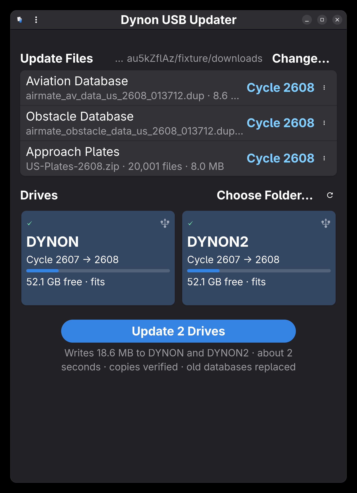
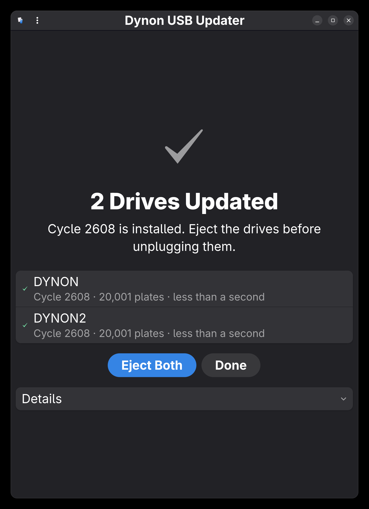
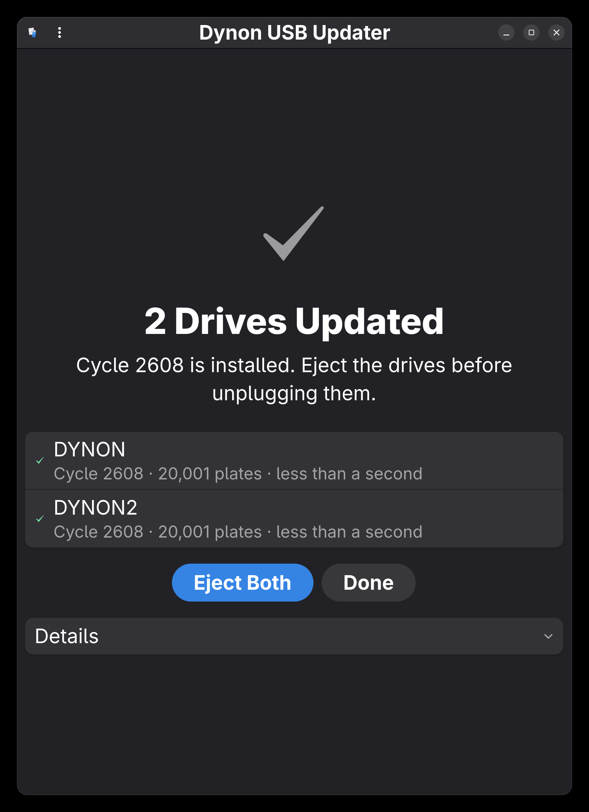
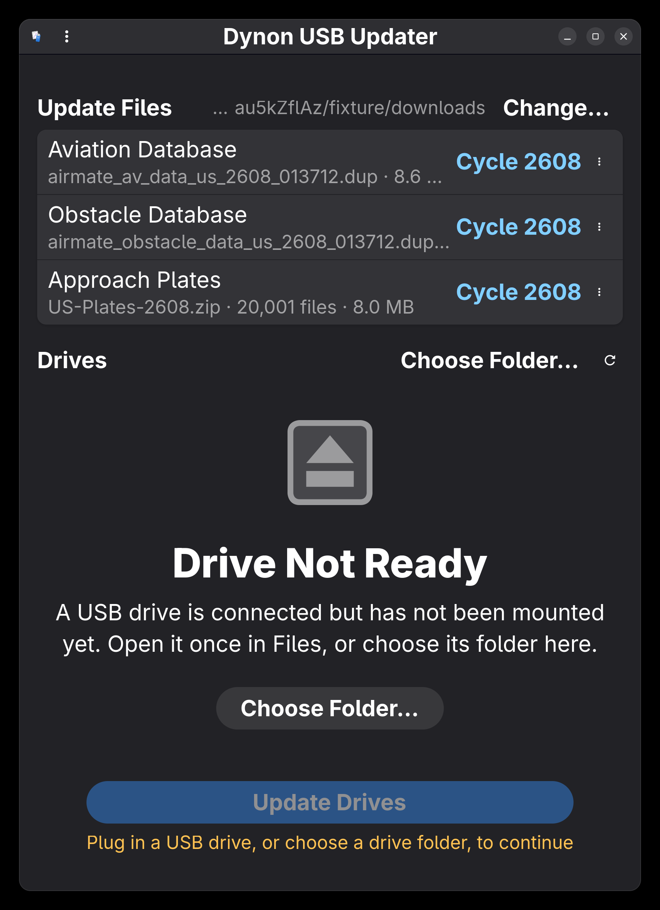

# Dynon USB Updater

Prepare the USB drives you carry to the aircraft: this app copies each AIRAC
cycle's aviation and obstacle databases onto them and replaces their approach
plates, for one drive or several at once. It can also check Dynon's own site
for a new cycle and download it for you — it only ever downloads; installing
a database to a drive still always takes you pressing Update.

[](https://github.com/yfilali/dynon-usb-updater/actions/workflows/ci.yml)
[](COPYING)



## What it does

Every cycle you download three things from your chart provider: an aviation
database, an obstacle database, and a plates archive. Some providers (Airmate)
ship the two databases as separate `.dup` files; Dynon ships its own free US
data as one combined `.duc` package containing both. Either way, for each USB
drive you select, this app:

1. copies the newest **aviation and obstacle databases** to the drive —
   two `.dup` files, or one `.duc` package, whichever you're using,
2. **erases `ChartData/Plates` and rebuilds it** from the plates archive.

It works out which files are newest by their cycle number, recognises which of
your USB drives are SkyView drives, checks each one has room before it starts,
and verifies every database it writes by reading it back.

## Installing

**Flathub** (recommended)

```sh
flatpak install flathub io.github.yfilali.DynonUSBUpdater
```

**Arch / Manjaro**

```sh
yay -S dynon-usb-updater
```

**From source** — see [Building](#building) below.

## Using it

Plug in your drives and open the app. It reads your Downloads folder, picks
this cycle's files, and pre-selects the SkyView drives it recognises — usually
there is nothing to do but press the button.


Each drive card tells you what is on that drive now, what it will become, and
whether the update fits. A drive is selected for you only when it is a
recognised SkyView drive, is writable, has room, and is not already on the
cycle you are installing; anything else you must select yourself, deliberately.

Press **Update** and confirm, and the app shows you exactly where it is:



When it finishes, it stays on the result and tells you what happened to each
drive. Nothing disappears on a timer.



## Checking for updates automatically

The first time you run the app, it asks two questions it will never guess for
you: whether your aircraft is **certified** (an STC'd install in a
type-certificated aircraft) or **Experimental/LSA**, and which provider your
database comes from. Both are changeable later in **Preferences → Aircraft**.

| Provider | Automatic download |
| --- | --- |
| Dynon | Yes — Dynon publishes its US aviation/obstacle data free, and the app checks its site directly |
| Airmate | No — [airmate.aero](https://www.airmate.aero) requires a subscription and its own download step |
| Seattle Avionics | No — [seattleavionics.com](https://www.seattleavionics.com) |
| Other | No |

Only Dynon is wired up: for anyone else, Preferences says plainly that
automatic download isn't available and links to that provider's own site.

For Dynon, **Preferences → Checking for Updates** lets you set how often it
checks (manual, daily, or weekly) and where it saves what it finds (your
Downloads folder by default). When it's due, it fetches Dynon's page for your
aircraft type — the certified page lists a current package and an upcoming
one with separate validity dates, and the app picks whichever one is actually
valid today, not just whichever the page happens to label "current" — and
downloads a new cycle the moment one becomes valid, notifying you when it
does. **It never installs anything to a drive on its own**; a downloaded
package shows up as a source next time you open the app, exactly like a file
sitting in your Downloads folder, and from there it's the same Update button
as always.

With a check interval set, closing the window doesn't quit the app — it
keeps running in the background so it can keep checking, and shows up in
GNOME's Quick Settings → Background Apps. **Quit**, in the app menu or
`Ctrl+Q`, is the deliberate way to actually exit.

## What it will and will not touch on your drives

This matters more than anything else in this README, so it is explicit:

**It writes:**

- the two `.dup` database files, or one combined `.duc` package, at the top
  level of the drive
- everything inside `ChartData/Plates`

**It deletes:**

- older aviation and obstacle `.dup` files, or older `.duc` database
  packages, and only those — a `.duc` is only ever deleted when it parses as
  a database package itself, never a firmware update sitting next to it —
  and only when *Replace Older Databases* is on (it is by default)
- the entire contents of `ChartData/Plates`, and only when you have selected a
  plates archive

**It never touches anything else** — your `CHARTS-*.key`, `FACTORY`, logbooks,
settings archives, manuals, flight logs, or any other file or folder on the
drive is left exactly as it was.

Other safety behaviour worth knowing:

- Every database is written to a temporary file, flushed, and only then renamed
  into place, so an interrupted copy can never leave a half-written file under
  the real name.
- *Verify Copies* (on by default) re-reads each database from the drive and
  compares SHA-256 against the source. A mismatch fails that drive and deletes
  the bad copy rather than leaving it.
- Space is checked per drive before anything is written, counting the space
  that clearing the old plates will free.
- Once the plates folder has been erased, stopping leaves it incomplete. The
  app says so plainly, asks you to confirm, and refuses to close silently while
  a run is in progress. It also prevents your computer from suspending mid-run.
- If one drive fails, the others still finish, and the result page tells you
  which failed and why.

## How it decides

**Which file is newest.** Dynon names files by AIRAC cycle —
`airmate_av_data_us_2608_013712.dup` is cycle 2608. The app ranks by that cycle,
falling back to a date in the filename and then the file's timestamp. The
trailing `013712` is the chart entitlement id, not a cycle, and is not mistaken
for one.

**Which drives are yours.** A drive is recognised as a SkyView drive by
evidence, not by its name: a `ChartData` folder, `.dup` files at the root, a
`CHARTS-*.key`, a `FACTORY` or settings folder, `.duc` packages, or a matching
volume label. It also compares the drive's chart key against the entitlement id
of the files you are installing, and warns you if the drive belongs to a
different SkyView.

**How the archive is unpacked.** A wrapping `ChartData/` and `Plates/` folder is
removed so plates land in the right place, archive litter (`.DS_Store`,
`Thumbs.db`, `__MACOSX`, …) is skipped, and any entry with an absolute path or
`..` in it causes the archive to be rejected outright.

## Troubleshooting

**My drive doesn't appear.** If you installed from Flathub, the sandbox may not
have permission to see removable media. The app detects this and tells you; the
fix is either to choose the drive's folder manually (which always works), or to
grant permission once:

```sh
flatpak override --user --filesystem=/run/media io.github.yfilali.DynonUSBUpdater
```

**It says the drive doesn't have room.** The figure counts the space that
erasing the current plates will free. If it still does not fit, the archive is
genuinely larger than the drive.

**I stopped the update part-way.** If it had started replacing plates, that
drive's plates folder is incomplete — run the update again before you fly with
it. Databases are unaffected: they are written whole or not at all.

**Where are the logs?** Every run writes one to
`~/.local/share/io.github.yfilali.DynonUSBUpdater/logs/`, and the last 20 are
kept. The **Details** section shows the current run, with buttons to copy or
save it.

**The window closed but the app is still running.** That's expected once a
check interval is set — it's checking for updates in the background, and
will show up in GNOME's Quick Settings → Background Apps. Reopen it by
launching the app again, or use **Quit** (app menu, or `Ctrl+Q`) to actually
exit.

## Building

Requires Rust 1.80+, GTK 4.16+, and libadwaita 1.7+.

```sh
meson setup build
meson install -C build
```

For development, plain Cargo works too — but the app needs its GSettings schema
to be findable:

```sh
cargo build
glib-compile-schemas data/
GSETTINGS_SCHEMA_DIR=data ./target/debug/dynon-usb-updater
```

Run the tests with `cargo test`. The suite covers cycle parsing, archive
handling (including path-traversal rejection), drive recognition, the
provider-page parser (against saved HTML fixtures — no test touches the
network), and full update runs against fixture directories. A few tests check
against real hardware and real cycle files and skip themselves when those are
absent.

| Path | What it is |
| --- | --- |
| `src/scan.rs` | Cycle parsing, database and `.duc` package discovery, archive inspection |
| `src/drive.rs` | Drive discovery, SkyView recognition, sandbox detection |
| `src/job.rs` | The update engine — copy, verify, erase, extract |
| `src/checker.rs` | Parses Dynon's pages and downloads a new cycle — never installs one |
| `src/application.rs` | App lifecycle: background hold, the checker's schedule, notifications |
| `src/background.rs` | The XDG Background portal request |
| `src/window.rs`, `src/ui/` | The interface |
| `docs/UX-SPEC.md` | The design this implements, and its acceptance criteria |
| `docs/PUBLISHING.md` | Packaging and release process |
| `screenshots/capture.sh` | Regenerates every screenshot below from fixtures |

## Screenshots

Every image below is generated by `screenshots/capture.sh` against fixture
data — never against real avionics drives.

### Ready to update

The prepare page: this cycle's files at the top, the drives that will receive
them below, and a single button that says exactly what it is about to do.


### Updating

One percentage for the whole job, the current step, a per-drive breakdown, and
a time estimate. The window title carries the progress too, so it is readable
from the overview.


### Finished

The result stays until dismissed, names every drive, and offers to eject.


### No drives connected

The app distinguishes "nothing is plugged in" from "this sandbox is not allowed
to see your drives", and offers a way forward in both cases.



## License and credits

GPL-3.0-or-later. Built by Yacine Filali.

Not affiliated with, endorsed by, or supported by Dynon Avionics. "Dynon" and
"SkyView" are trademarks of Dynon Avionics, Inc.
